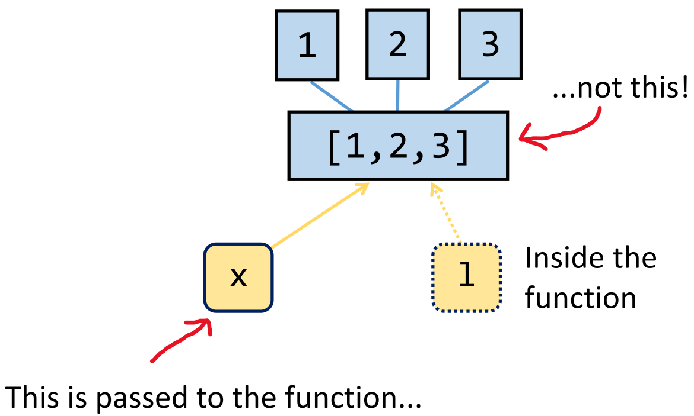

# Passing by Reference

We’ve already talked about how Python *references* objects before. In this chapter, we’ll take a closer look at how these *references* behave when you pass variables into functions.  
Python function calls use "pass-by-reference".
So, when you call a function and pass a parameter (i.e. a variable) into the functon, what actually gets passed into the function is a *reference* to the object, not a copy of the object (that would be called "pass-by-value"). That means if the function changes that variable, those changes are visible outside the function too, because both the original variable and the function parameter point to the same object in memory.

In the following example we
 * declare a function `foo` which takes one parameter ("a list" `l`) and appends a value to it
 * create a list containing three elements
 * create a variable `x` referencing that list with the three elements
 * call the function `foo` with `x` as the parameter.   
 
 Let's break down what happened:

 * The variable `x` points (or *references*) a list stored in memory (the list [1, 2, 3] we created).
* When we call `foo(x)`, the variable `l` inside `foo` becomes another reference to the *same* list.
* Inside `foo`, we append `4` to that list, but do not return anything.
* We print `x` before and after calling `foo`, and we can see that the list saved behind `x` appears changed after calling `foo`. This is because both `x` and `l` refer to the same object and when we edit `l`, we just edit what `l` references to.


```python
def foo(l):
    l.append(4)

x = [1, 2, 3]
print(x)
foo(x)
print(x)
```
*Output:* 
```
[1, 2, 3]
[1, 2, 3, 4]
```

Things to keep in mind:

 * A **variable** in Python doesn’t store the actual value directly, it stores a **reference** to the object in memory.
 * A variable is not the same thing as its value.
 * Multiple variables can reference the same thing in memory.
 * When passing a variable to a function, it's **only the reference** that is passed into the function, not a copy of the value.

 


 You could also write a similar example where the function doesn’t take any arguments at all, but still modifies the same list directly.
 So semantically, the following would result in the exact same outcome as the example above:

 ```python
x = [1, 2, 3]
def foo():
    x.append(4)
print(x)
foo()
print(x)
```
*Output:* 
```
[1, 2, 3]
[1, 2, 3, 4]
```
In this example `foo` does not actually take any arguments. Instead, we reference `x` directly, rather than taking the detour of using `l`. This works because `x` is a global variable. However, this also means that our `foo` function only works for this one specific variable named `x`. If you wanted to reuse the same function with a different list, you couldn’t. 
That’s why it’s better practice to **pass data in as a parameter** (and to avoid global variables), it makes your functions more flexible and reusable.

*Sidenote:* This website provides an excellent visual debugger that makes it easy to understand how your code executes and how references behave: [https://pythontutor.com/](https://pythontutor.com/)

# **Exercise**
Write  a function called `add_suffix` that takes two arguments: a list of strings (`words`) and a string (`suffix`). Your function should append the `suffix` to each word in the list, modifying the list in place. Since your function modifies the list in place it should not return anything.


# To test markdown feature

This is an example of an ```output annotation:

```output 
# what happens with this comment? 
[1,25,34,21]
```

This is an exmaple for an ```warning annotation:

```warning
If you don't define a base case, this recursion will enter an endless loop. 
```

This is an example where no annotation is provided

```
[1,2,3]
print("hello world)
```